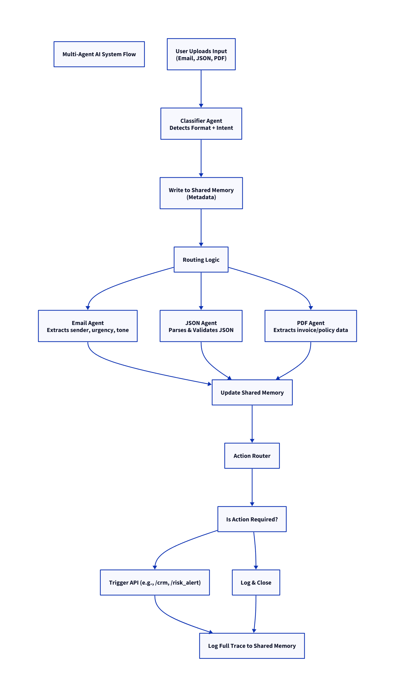

# Multi-Format Autonomous AI System with Contextual Decisioning & Chained Actions

## Project Overview
This system processes multi-format inputs (Email, JSON, PDF), classifies both format and business intent, routes the data to specialized agents for detailed extraction and validation, and triggers follow-up actions dynamically. All interactions and decisions are logged in a shared memory store for auditability.

## Architecture



- **Classifier Agent**: Detects input format (Email, JSON, PDF) and business intent (RFQ, Complaint, Invoice, Regulation, Fraud Risk) using few-shot learning with LangChain/OpenAI.
- **Email Agent**: Extracts sender, urgency, issue/request, and analyzes tone to decide escalation or closure.
- **JSON Agent**: Validates webhook JSON schema and flags anomalies.
- **PDF Agent**: Extracts invoice or policy details, flags high invoice totals and compliance terms.
- **Shared Memory Store**: SQLite database storing logs of inputs, classification results, agent outputs, and action traces.
- **Action Router**: Triggers follow-up actions (e.g., CRM escalation, risk alerts) with retry logic and logs outcomes.

## Tech Stack
- Python 3.10+
- FastAPI for REST endpoints
- LangChain/OpenAI for classification & extraction
- PyPDF2 for PDF parsing
- SQLite for shared memory
- Requests for HTTP action routing

## Setup Instructions
1. Install dependencies:
   ```bash
   pip install fastapi uvicorn langchain pydantic PyPDF2 requests reportlab textblob

2. ENV file  
   Gemini API Key
   ```bash
   GEMINI_API_KEY="your_gemini_api_key"
   ```
